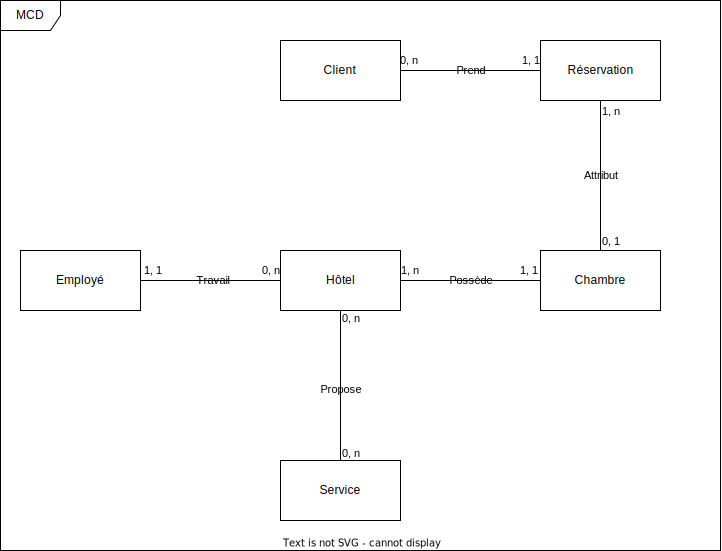

# Travaux pratiques : Gestion Hôtelière

## Pour démarrer :

-  Le sujet du TP dans `docs/TP FINAL - JPA - Doranco.pdf`
-  Editez le fichier `persistence.xml` en y ajoutant les informations de connexion à votre base de donnée.

## 🚀 Fonctionnement du Programme
Ce guide vous aidera à démarrer avec notre programme en quelques étapes simples. Suivez les instructions ci-dessous pour utiliser le programme efficacement.

## 🛠️ Compilation
Pour préparer le programme à l'exécution, commencez par compiler le code source. Ceci préparera l'application pour être exécutée sur votre système.

## 🏃‍♂️ Exécution
Une fois compilé, vous pouvez exécuter le programme. À l'ouverture, l'application vous présentera plusieurs options pour interagir avec les données :

- **Créer (CREATE)** : Ajoutez de nouvelles données dans le système.
- **Lire (READ)** : Consultez les données existantes.
- **Modifier (UPDATE)** : Apportez des modifications aux données sélectionnées.
- **Supprimer (DELETE)** : Retirez les données inutiles ou obsolètes.
## 📊 Types de Données
Vous aurez le choix entre différents types de données pour effectuer votre action :

- **Chambre (BEDROOM) (WIP)** : Gestion des chambres d'hôtel.
- **Réservation (BOOKING) (WIP)** : Gestion des réservations.
- **Client (CLIENT) (WIP)** : Gestion des informations clients.
- **Employé (EMPLOYEE)** : Gestion des employés de l'hôtel.
- **Hôtel (HOTEL)** : Informations sur l'hôtel et sa gestion.
- **Service (SERVICE) (WIP)** : Gestion des services offerts par l'hôtel.
## 📝 Suivre les Instructions
Après avoir choisi le type de donnée et l'action à effectuer, suivez simplement les instructions affichées dans la console pour mener à bien votre tâche. Le programme vous guidera à travers chaque étape nécessaire pour compléter l'action choisie.

## 📊 Diagrammes du Projet
Pour une meilleure compréhension de la structure et du fonctionnement de notre base de données, consultez les diagrammes suivants situés dans le dossier `./merise/ du projet` :

### 🗂️ Modèle Conceptuel de Données (MCD)
Le MCD offre une vue d'ensemble des entités et des relations entre elles. Cela vous aide à comprendre comment les données sont organisées au niveau conceptuel.

### 📐 Modèle Logique de Données (MLD)
Le MLD traduit le MCD en une structure prête pour l'implémentation, définissant les tables, les clés primaires, les clés étrangères, et les relations entre les tables.

### 🛠️ Modèle Physique de Données (MPD)
Le MPD est la dernière étape de la modélisation, où le MLD est transformé en instructions SQL spécifiques pour la création de la base de données. Cela comprend la définition des index, des contraintes, et d'autres éléments nécessaires à l'implémentation physique de la base de données.

Ces diagrammes sont essentiels pour comprendre la structure de la base de données de notre projet et pour guider le développement et la maintenance du système.

# ⚠️ Note importante pour William
Ce README a été arrangé par ChatGPT seulement pour le rendre plus jolie 🙂
